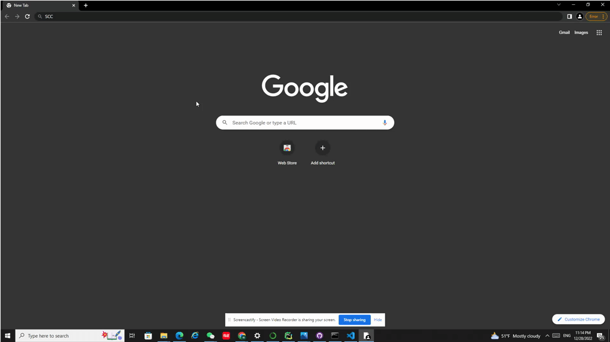

## PyScreen


## Install  

```
git clone https://github.com/nicholaslyu/PyScreen.git
```
## Run
```
cd PyScreen
python start.py
```


## Use


* Press keys __S,C,and Shift__ to start the screenshot
* Press keys __S,E,and C__ to shut down the app


## Demo


